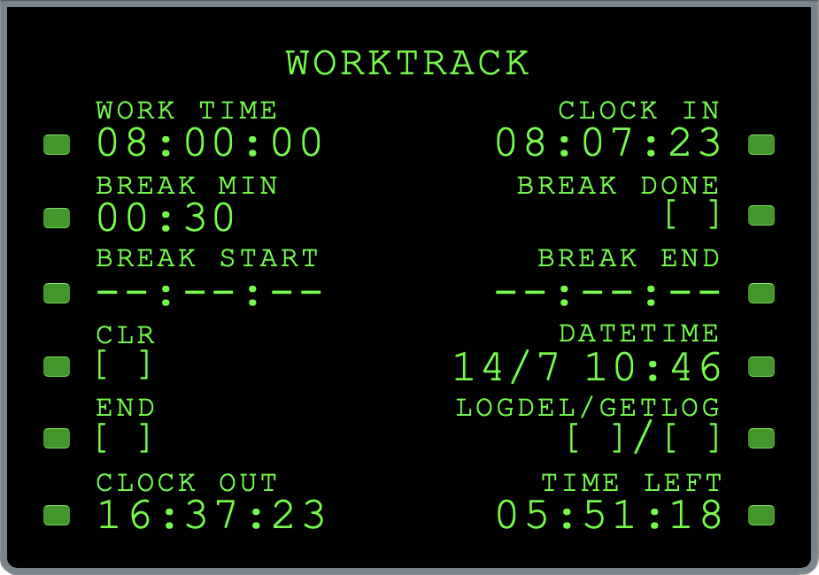

# WorkTrack

**WorkTrack** is a browser-based tool for recording daily work sessions.



---

## Features

- Log expected work duration, expected break duration, and clock-in time
- Calculates:
  - Expected clock-out time
  - Remaining time in the workday
- Adjusts calculations if:
  - Actual break duration differs from the planned break
  - A session ends early
  - Work continues into overtime
- Stores session data locally, so it persists across page reloads
- JSON export/import:
  - Download a log of your work history
  - Upload a previous log
  - Clear stored data
- Cockpit-style UI modeled after the Flight Management Computer of the iconic McDonnell Douglas MD-11 aircraft

### Example JSON log output (DD-MM-YYYY, 24h):
```json
{
  "16-01-2025": [
    {
      "clockIn": "08:04:23",
      "clockOut": "16:33:43",
      "workTime": "08:00:01",
      "breakStart": "13:17:55",
      "breakEnd": "13:47:14",
      "breakTime": "00:29:19"
    }
  ]
}
```

---

## Tech Stack

- **HTML**: Structure
- **CSS**: Styling
- **JavaScript**: Time calculations, data storage, and JSON export/import

---

## Usage

Open the app on the [GitHub Pages site](https://4l3b.github.io/WorkTrack/) to launch it in your browser. The app runs as a popup, and instructions for logging work sessions, tracking breaks, and exporting/importing JSON logs are available within the launching interface.

---

WorkTrack © 2025 by Alessandro Bigolin - [CC BY-NC-SA 4.0].

See LICENSE file: [https://github.com/4l3b/WorkTrack/blob/main/LICENSE].
